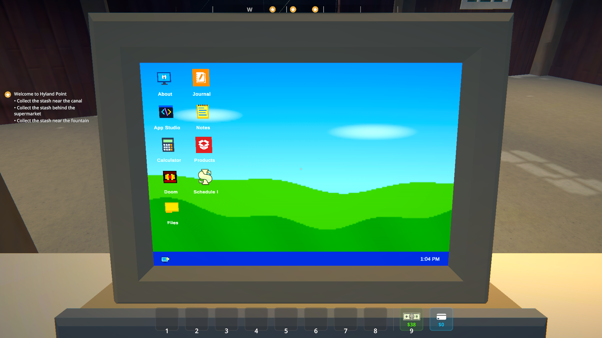
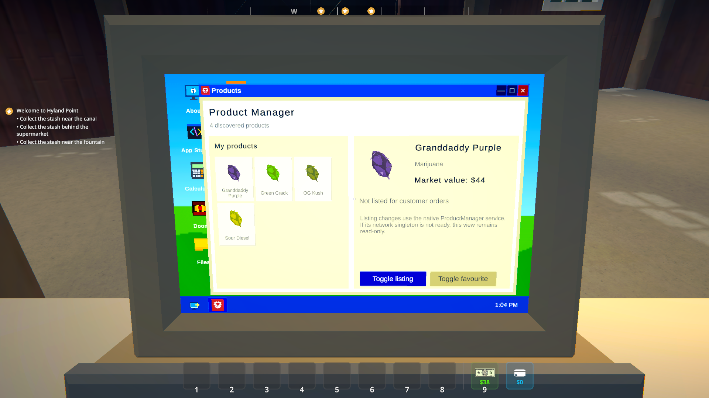
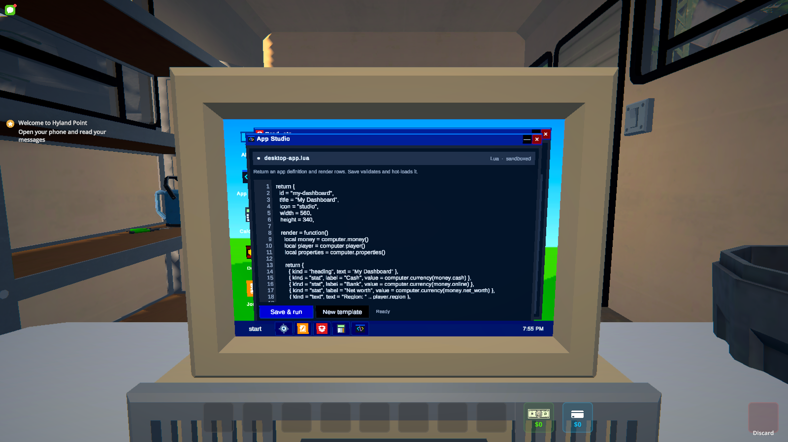
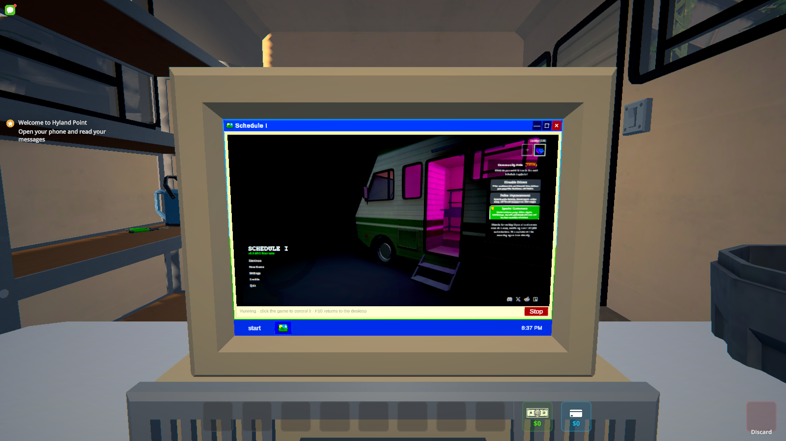

# Usable Computer

A placeable, working computer for Schedule I with an XP-inspired desktop, native game apps, Lua scripting, Doom, and Schedule I running inside itself.



Usable Computer builds its furniture model at runtime from the game's laundering-station table and old computer. The desktop, icons, wallpaper, windows, and app UI are also created in code. There is no prefab bundle or embedded copy of the game's assets.

## What it does

- Adds a 4x2 computer desk to both hardware shops for $750.
- Opens through the game's normal interaction flow with a close-up camera and proper input cleanup.
- Includes Files, Notes, Calculator, Journal, Product Manager, Settings, App Studio, Doom, and Schedule I apps.
- Reuses live phone icons and product images for native integrations without cloning the phone UI.
- Supports movable, minimizable, maximizable, and closable desktop windows.
- Includes persistent light and dark themes plus three independently selected desktop backgrounds.
- Offers Small, Medium, and Large desktop icons, with automatic ordering by name or folders first.
- Keeps the Start menu program list scrollable, with Settings and Power off always available.
- Lets C# mods register apps through a small public API.
- Lets players write and save sandboxed Lua apps from App Studio.
- Includes a sandboxed per-save virtual filesystem for desktop folders and app shortcuts.
- Supports both Mono and IL2CPP builds.

## Screenshots

| Product Manager | App Studio |
| --- | --- |
|  |  |

### Schedule I inside Schedule I



The Schedule I app launches a second game process and streams its Unity cameras into the desktop window. The child runs with an isolated MelonLoader setup and a separate save profile, so it cannot open the outer game's active save by accident.

This feature is Windows-only and runs two complete game instances. Expect a meaningful CPU, GPU, and memory cost. Click the nested game to control it, press `F10` to return to the desktop, and save before pressing Stop.

### Display size and rendering cost

The runtime model is 15% larger than the laundering-station donor, while its 4x2 placement footprint and collision setup stay unchanged. Interaction centers the view on the physical screen. It uses a 55-degree field of view at 16:9 and wider aspect ratios, and widens the view for narrower windows so the screen remains visible. Resizing while the computer is open updates the view automatically.

Nested Schedule I renders at 960x540. Each uncompressed RGBA frame is about 2.0 MiB, compared with 0.9 MiB at the previous 640x360 setting. This is 2.25 times as many pixels per capture, but remains below the bridge's existing 1280x720 capacity.

## Requirements

- Schedule I
- [MelonLoader](https://github.com/LavaGang/MelonLoader)
- A matching [S1API](https://github.com/ifBars/S1API) build
- The Mono build for the alternate Steam branch, or the IL2CPP build for the normal public branch

There is not a packaged release yet. The project can be built and installed locally using the steps below.

## Build and install

Copy [`local.build.props.example`](local.build.props.example) to `local.build.props` and set the paths for both game runtimes and your local S1API builds. The local file is ignored by git because it contains machine-specific paths.

```powershell
dotnet build UsableComputer.csproj -c Mono
dotnet build UsableComputer.csproj -c Il2cpp
```

Install the matching build output like this:

```text
Mods/
  UsableComputer_Mono.dll or UsableComputer_Il2cpp.dll

UserLibs/
  ManagedDoom.Core.dll
  MoonSharp.Interpreter.dll
  UsableComputer.ChildHost.dll
```

Set `AutomateLocalDeployment=true` in `local.build.props` if you want builds copied to your configured game installations. It is disabled by default.

## Built-in apps

Journal and Product Manager read the native game state through narrow adapters. Journal can track quests, while Product Manager displays discovered product art, values, listing state, and favourite state. Neither app reparents or drives the phone canvas.

Notes persist through MelonPreferences. Appearance settings also persist, with theme and background stored separately so switching light or dark mode does not replace the wallpaper.

In Settings, choose a desktop icon size and select **Arrange by name** or **Folders first**. The chosen order is maintained as apps and folders change, with stable node IDs breaking ties between equal names. Size and ordering preferences are shared by all computers and survive game and save reloads. Overflowing desktops have a horizontal scrollbar; long icon labels are shortened to fit their clickable cells. The Start menu program list supports mouse-wheel scrolling and a scrollbar independently of its fixed footer.

Files organizes the desktop through a virtual filesystem stored with the active Schedule I save. Create and rename folders from the Files app, then cut and paste app shortcuts between folders. Empty folders can be deleted. Virtual paths never map to arbitrary files on the host computer, and unavailable mod-app shortcuts remain in place so they recover if the app is installed again.

### Doom

Doom uses the vendored [Managed Doom](https://github.com/sinshu/managed-doom) engine. The mod does not include game data. Add an IWAD you own, or a compatible free IWAD such as [Freedoom](https://github.com/freedoom/freedoom), to:

```text
UserData/UsableComputer/Doom
```

Recognized names are `doom.wad`, `doom1.wad`, `doom2.wad`, `freedoom1.wad`, and `freedoom2.wad`. Press `F10` to release Doom's input. Audio is not implemented yet.

### Lua apps

App Studio saves Lua apps to `UserData/UsableComputer/Apps` and hot-loads them without restarting the game. Scripts can read player, money, property, employee, product, and quest data through a small S1API-backed surface.

```lua
return {
  id = "business-dashboard",
  title = "Business Dashboard",
  icon = "studio",

  render = function()
    local money = computer.money()

    return {
      { kind = "heading", text = "Business Dashboard" },
      { kind = "stat", label = "Cash", value = computer.currency(money.cash) },
      { kind = "stat", label = "Bank", value = computer.currency(money.online) },
    }
  end
}
```

Lua apps cannot access the filesystem, operating system, CLR, Unity objects, or raw S1API types. Source is limited to 64 KiB, rendered output is limited to 64 rows, and each invocation has a 250 ms execution budget.

## Add a C# app

Mods can reference `UsableComputer.dll` and register an app without depending on runtime-specific TextMeshPro or Schedule I types:

```csharp
using UsableComputer.API;
using UnityEngine;

DesktopAppRegistry.Register(new DesktopAppDescriptor(
    id: "my-mod.app",
    title: "My App",
    glyph: "M",
    preferredWindowSize: new Vector2(440f, 300f),
    preferredWindowPosition: Vector2.zero,
    createSession: context => new MyDesktopSession(context)));
```

Each window gets its own `IDesktopAppSession`. Apps registered after the computer opens appear immediately, and unregistering an app closes its windows and disposes its sessions. See [`examples/ManualDesktopAppSample`](examples/ManualDesktopAppSample) for a complete buildable example.

## Development

The focused verifiers cover the calculator model, app registry, virtual filesystem, Lua host, and Doom adapter without starting Unity:

```powershell
dotnet run --project tests\UsableComputer.CalculatorModelVerifier\UsableComputer.CalculatorModelVerifier.csproj -c Release
dotnet run --project tests\UsableComputer.RegistryVerifier\UsableComputer.RegistryVerifier.csproj -c Release
dotnet run --project tests\UsableComputer.FileSystemVerifier\UsableComputer.FileSystemVerifier.csproj -c Release
dotnet run --project tests\UsableComputer.LuaVerifier\UsableComputer.LuaVerifier.csproj -c Release
dotnet run --project tests\UsableComputer.DoomVerifier\UsableComputer.DoomVerifier.csproj -c Release -- C:\path\to\an\iwad.wad
```

Camera and display changes have a Mono smoke test that isolates the target install's mod directory, loads a disposable save copy, and captures the physical computer:

```powershell
.\tests\Run-DisplaySmoke.ps1 -GamePath C:\path\to\Schedule-I -SourceSavePath C:\path\to\SaveGame
```

The VFS smoke runner builds an isolated test mod, copies a completed save into a temporary fixture, proves persistence across two game processes, captures the Files window, and restores the target install afterward:

```powershell
.\tests\Run-VfsSmoke.ps1 -Runtime Mono -GamePath C:\path\to\ScheduleI -SourceSavePath C:\path\to\SaveGame_1
.\tests\Run-VfsSmoke.ps1 -Runtime Il2cpp -GamePath C:\path\to\ScheduleI -SourceSavePath C:\path\to\SaveGame_1
```

Pure verifier passes do not replace an in-game test. Test the matching build in a backed-up or disposable save before release.

Open work is tracked in [GitHub Issues](https://github.com/ifBars/ScheduleOne-UsableComputer/issues).

## License and game assets

Usable Computer is licensed under GPL-2.0-or-later because it includes Managed Doom. MoonSharp remains under its BSD license. See [`THIRD_PARTY_NOTICES.md`](THIRD_PARTY_NOTICES.md) and the vendored license files for attribution and terms.

No Schedule I assemblies, decompiled code, AssetRipper exports, prefabs, textures, scenes, executable files, or generated IL2CPP wrappers are included. Native game models and sprites are resolved from the player's installed copy at runtime.

This is an unofficial community mod and is not affiliated with or endorsed by TVGS.
