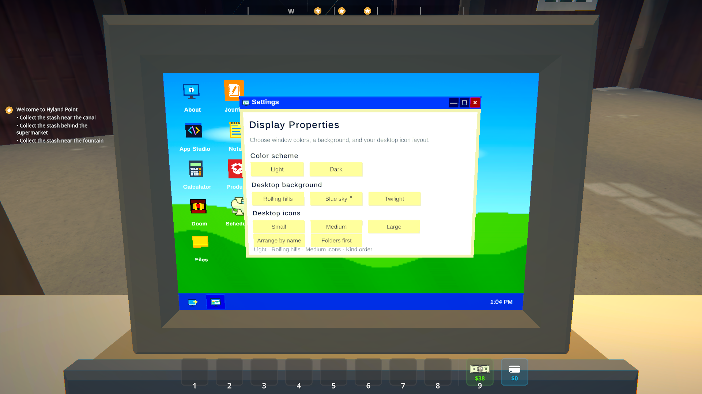
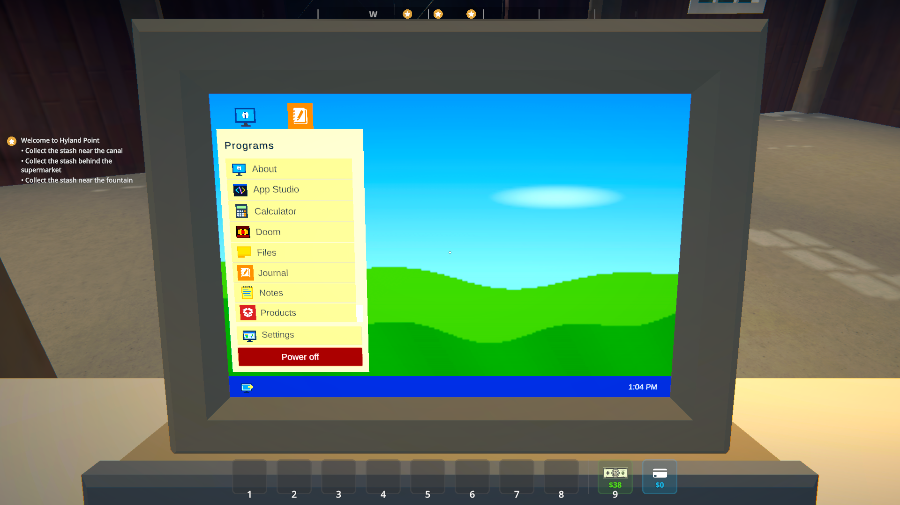

# Usable Computer

**Your very legitimate business needs a computer.**

A working, placeable computer for Schedule I. Check your products, keep notes, write a little app, or play Schedule I inside Schedule I. All from an XP-inspired desktop on a CRT.

[Install](#install) · [Take a look](#make-yourself-at-home) · [Make an app](#make-an-app) · [Development](docs/development.md) · [Report a bug](https://github.com/ifBars/ScheduleOne-UsableComputer/issues)


Buy the **$750 computer desk** from either hardware shop, place it in a **4×2 space**, and interact with it to open the desktop.

> [!NOTE]
> There isn't a packaged release yet. Installation currently requires building from source. Both Mono and IL2CPP are supported.

## Make yourself at home

Move windows around, minimize them to the taskbar, or maximize an app when you need the space. Pick a light or dark theme, one of three wallpapers, and Small, Medium, or Large icons.

| Pick your desktop | Find your programs |
| --- | --- |
|  |  |
| Appearance settings survive restarts. Changing the theme keeps your wallpaper. | The program list scrolls; Settings and Power off stay within reach. |

Arrange icons by name or put folders first. Files lets you create and rename folders, move app shortcuts, and delete empty folders. Folders belong to your save; appearance preferences and Notes are shared across saves. When the desktop fills up, scroll horizontally to reach the rest.

The close-up view stays centered on the screen as you resize the game.

## Get some work done

| App | What you can do |
| --- | --- |
| **Products** | Browse discovered products, their art and values, and their listing and favourite state. |
| **Journal** | View and track your quests. |
| **Notes** | Keep a persistent scratchpad. |
| **Calculator** | Work out the numbers without leaving the desk. |
| **Files** | Organize folders and app shortcuts. |
| **App Studio** | Write Lua apps and load them without restarting. |


## Get absolutely no work done

### Doom

Drop an IWAD you own, or a free [Freedoom](https://github.com/freedoom/freedoom) IWAD, into `UserData/UsableComputer/Doom`, then open Doom.

Supported filenames: `doom.wad`, `doom1.wad`, `doom2.wad`, `freedoom1.wad`, and `freedoom2.wad`. Game data isn't included, and audio isn't implemented yet. Press **F10** to release the game's input.

### Schedule I inside Schedule I


The Schedule I app launches a second game instance and streams it into a desktop window. It uses a separate save profile and isolated MelonLoader setup to keep it apart from your outer game.

**Windows only.** This runs two complete games, with the CPU, GPU, and memory cost that implies. Click inside to take control, press **F10** to return to the desktop, and save before pressing **Stop**.

## Install

You'll need Schedule I, [MelonLoader](https://github.com/LavaGang/MelonLoader), a matching [S1API](https://github.com/ifBars/S1API) build, and the .NET SDK.

1. Clone this repository and copy [`local.build.props.example`](local.build.props.example) to `local.build.props`.
2. Set the paths to your game installations and local S1API builds in that file.
3. Build the configuration that matches your game:

   | Steam branch | Build command | Output directory |
   | --- | --- | --- |
   | Alternate / Mono | `dotnet build UsableComputer.csproj -c Mono` | `bin/Mono/netstandard2.1/` |
   | Public / IL2CPP | `dotnet build UsableComputer.csproj -c Il2cpp` | `bin/Il2cpp/net6.0/` |

4. Copy the matching mod DLL and its companion libraries from the output directory into your game installation:

   ```text
   Mods/
     UsableComputer_Mono.dll OR UsableComputer_Il2cpp.dll

   UserLibs/
     ManagedDoom.Core.dll
     MoonSharp.Interpreter.dll
     UsableComputer.ChildHost.dll
   ```

Install only the mod DLL for your runtime. Keep the matching S1API installation alongside it. To deploy future builds automatically, set `AutomateLocalDeployment=true` in `local.build.props`; it is off by default.

## Make an app

App Studio saves scripts to `UserData/UsableComputer/Apps` and hot-loads them. Build a dashboard from player, money, property, employee, product, and quest data.


Lua runs in a sandbox: no operating-system access, arbitrary files, CLR, or raw Unity objects. Each invocation has a 250 ms budget, with a 64 KiB source limit and up to 64 rendered rows.

**[Write your first Lua app or register a C# app →](docs/app-development.md)**

C# mods can add apps through the public registry. Each window owns its own session; registration updates the desktop immediately. A [buildable sample mod](examples/ManualDesktopAppSample) is included.

## Contributing

Found a bug or have an app idea? [Open an issue](https://github.com/ifBars/ScheduleOne-UsableComputer/issues). For bugs, include your runtime, what you did, and what happened. A screenshot helps with desktop or camera problems.

For code changes, start with the [contributor guide](AGENTS.md), [coding standards](CODING_STANDARDS.md), and [development and testing guide](docs/development.md).

## Credits and license

Built with [S1API](https://github.com/ifBars/S1API), [Managed Doom](https://github.com/sinshu/managed-doom), and [MoonSharp](https://www.moonsharp.org/).

Usable Computer is **GPL-2.0-or-later** because it includes Managed Doom. MoonSharp retains its BSD license. See [third-party notices](THIRD_PARTY_NOTICES.md) and the vendored licenses for details.

Game models and sprites come from the player's installed copy at runtime. This repository doesn't distribute Schedule I assets or assemblies.

An unofficial community mod, not affiliated with or endorsed by TVGS.
