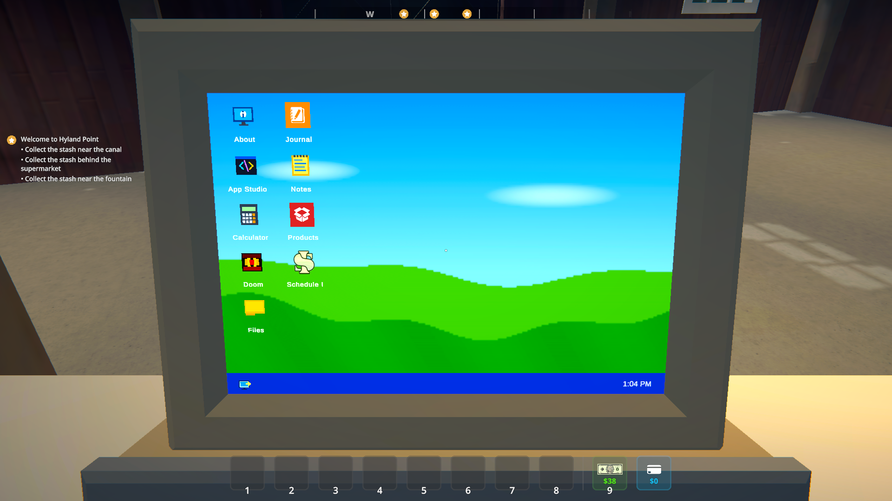
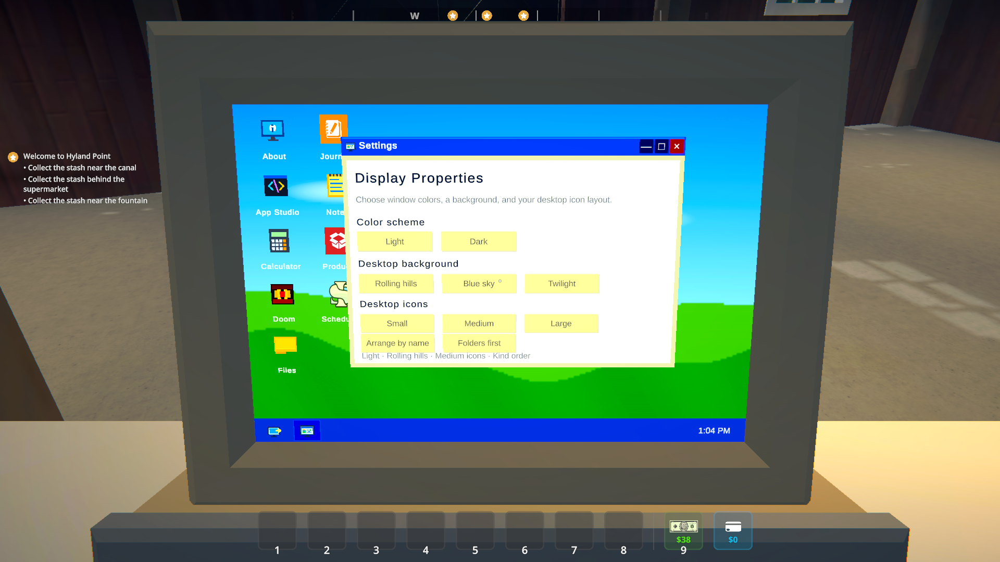
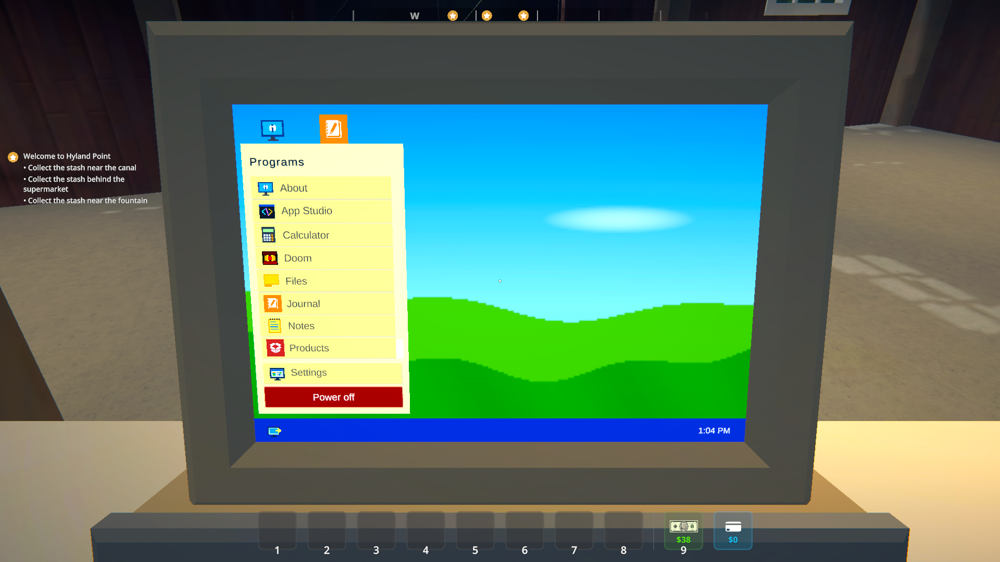
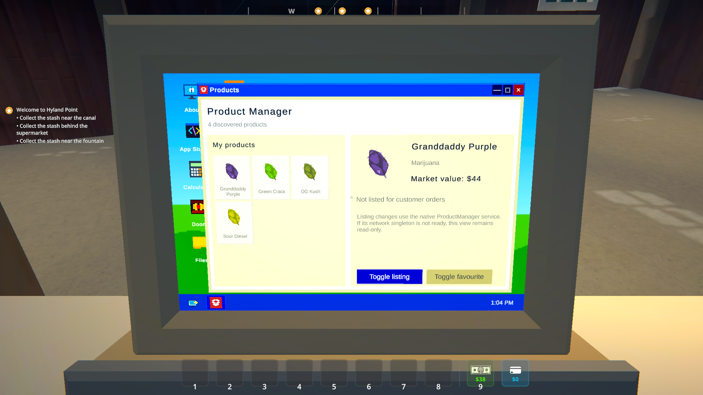
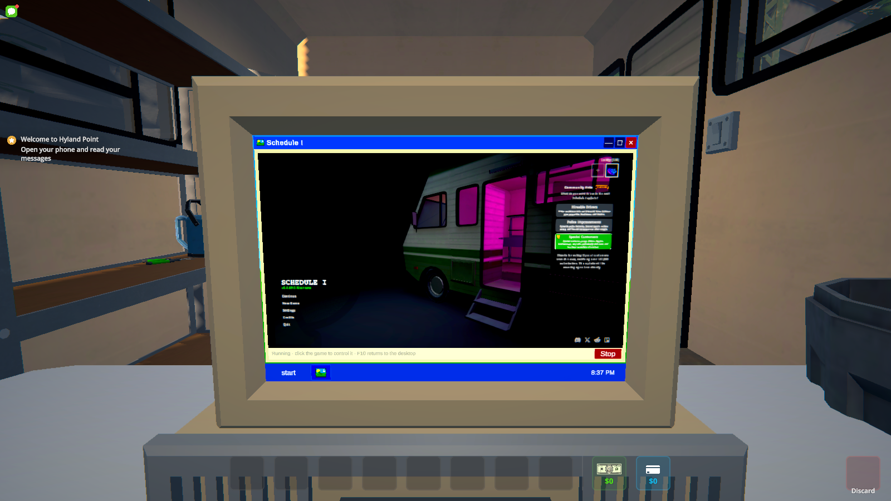
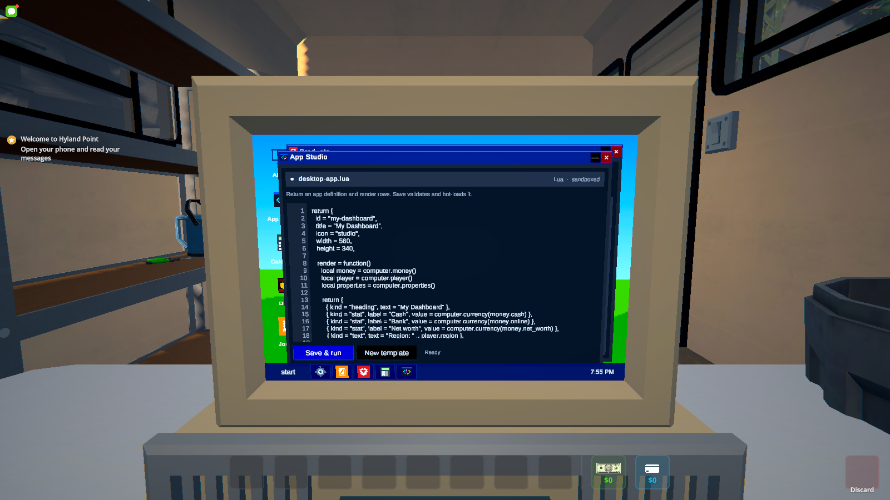

# Usable Computer

**Your very legitimate business needs a computer.**

A pair of working, placeable computers for Schedule I. Check your products, keep notes, write a little app, or play Schedule I inside Schedule I. Both run the same XP-inspired desktop.

[Install](#install) · [Take a look](#make-yourself-at-home) · [Make an app](#make-an-app) · [Development](docs/development.md) · [Report a bug](https://github.com/ifBars/ScheduleOne-UsableComputer/issues)



Buy the **$750 computer desk** or **$750 laptop desk** from either hardware shop, place it in a **4×2 space**, and interact with the screen to open the desktop. The laptop uses the new special-customer model from the installed 0.4.7f6 beta.

Both items include a table. The current furniture placement system supports floor grids and wall/roof surfaces, but not placement on top of a separately placed table.

> [!NOTE]
> Local candidate packages target Schedule I **0.4.7f6** and include the matching S1API hosting preview. Both Mono and IL2CPP are supported. No public release has been published yet.

## Make yourself at home

App Studio includes draft switching, a scrolling line-number gutter, source-line diagnostics, and Save & run that launches your app. See the [editor guide](docs/app-studio.md) for shortcuts and draft lifetime.

Move windows around, minimize them to the taskbar, or maximize an app when you need the space. Pick a light or dark theme, one of three wallpapers, and Small, Medium, or Large icons.

| Pick your desktop | Find your programs |
| --- | --- |
|  |  |
| Appearance settings survive restarts. Changing the theme keeps your wallpaper. | The program list scrolls; Settings, Restart, and Shut down stay within reach. |

Arrange icons by name or put folders first. Files lets you create folders, rename and move files or folders, move app shortcuts, and delete files or empty folders. Folders and text documents belong to your game save; appearance preferences are shared across saves. When the desktop fills up, scroll horizontally to reach the rest.

Notes supports New, Open, Save, and Save as. Enter a virtual path such as `/Desktop/Shopping list.txt`, or double-click a document in Files or on the desktop. Save updates the open document even after it is moved or renamed; Save as creates a separate file and never overwrites an existing name. Documents are written to disk with the next game save. Unsaved drafts survive closing the Notes window, but not leaving the game save. Choose Discard to abandon a draft. Import old note copies the previous global note into a new document without deleting the original preference.

The virtual disk supports UTF-8 text up to 64 KiB per file and 1 MiB across all files, with a 2,048-item limit. It is shared by computers within the current save and does not expose your Windows files.

The close-up view stays centered on the screen as you resize the game.

Use **Shut down** or **Restart** in Start. An off computer accepts **Enter** or its **Power on** button, then boots through a short BIOS-style sequence. Leaving the desk keeps your session running. [Power behavior](docs/computer-power.md).

## Get some work done

| App | What you can do |
| --- | --- |
| **Products** | Search discovered products, filter by type/listing/favourites, sort by value, and choose compact or large image tiles. |
| **Journal** | View and track your quests. |
| **Reports** | Review daily receipts or seven-day bank summaries and save reports to your desktop. |
| **Deliveries** | Track incoming supplies, inspect previous orders, and confirm reorders at current prices. |
| **Dealers** | Check held cash and stock, review customer coverage, and assign or remove customers. |
| **System Monitor** | Inspect drivers and services, stop or restart them, and diagnose faults. |
| **Notes** | Keep a persistent scratchpad. |
| **Calculator** | Work out the numbers without leaving the desk. |
| **Files** | Organize folders and app shortcuts. |
| **App Studio** | Write Lua apps and load them without restarting. |



Reports records native bank transactions while you play, even with the computer closed. Browse the last 28 observed days, check your current cash and shared bank balance, and use **Save report** to create a text document in Files. Each export gets a separate name, so earlier copies remain intact.

Choose **7 days** for a summary ending on the selected day, or **Daily** to return to receipts. Summary exports include daily money in, money out, and net bank movement. Days without observations are marked as unknown rather than zero activity.

Daily totals include all recorded bank transactions; each day keeps its latest 128 receipts. Recording starts when the save is loaded with this mod. Earlier activity cannot be reconstructed, and receipt times are the time they were observed. Transfers and deposits count as bank activity, so the net figure is **bank movement, not profit**. Cash sales and wages are not itemized. History is saved with the game and is currently available to the session host; co-op clients can check their cash and the shared bank balance.

Deliveries reads the game's active orders and previous receipts. Select a previous order to review its items, destination, dock, and current total including delivery. **Reorder...** opens a confirmation; **Confirm** pays through the game's existing delivery service. An unfinished phone cart blocks reordering until you finish or clear it. New orders and changes to destinations remain on the phone. Reports and Deliveries link to each other so you can check spending and restock from the same desk.

Dealers shows recruited dealers, their held cash, sales cut, home, and inventory including overflow storage. Product counts are units, grouped by product and quality. Review assigned customers or choose **Assign customer** to use the game's normal assignment flow. Assignment and removal require confirmation; assigning a customer expires any outstanding offer from them, just like the phone. Collect cash and supply stock in person.

C# mods can register **drivers** with the desktop kernel. Drivers run background services, exchange events, own apps and subscriptions, and customize supported shell behavior while you play. System Monitor lets you stop or restart them without leaving the save. The [driver guide and example](docs/driver-platform.md) demonstrate a live taskbar-clock replacement that restores the original clock when stopped. Drivers are trusted game mods; Lua apps retain their sandbox.

## Get absolutely no work done

### Noodle

Play the native Noodle game in a desktop window with arrow keys or direction buttons. Switching windows pauses the round. It uses the installed game's artwork and an independent game instance. See [Noodle](docs/noodle.md) for controls and compatibility notes.

### Egg Run

Jump over obstacles with Space, Up, or the Jump button. Egg Run uses native graphics and scenery in its own desktop playfield, pauses when unfocused, and saves authorized high scores through the game. See [Egg Run](docs/egg-run.md).

### Apps from other mods

Compatible S1API phone and TV apps appear automatically when they implement S1API's independent display-session contract. They need no UsableComputer reference or registration. Device-dependent apps stay on their original device and produce a diagnostic. See [S1API app hosting](docs/s1api-external-hosting.md).

### Doom

Drop an IWAD you own, or a free [Freedoom](https://github.com/freedoom/freedoom) IWAD, into `UserData/UsableComputer/Doom`, then open Doom.

Supported filenames: `doom.wad`, `doom1.wad`, `doom2.wad`, `freedoom1.wad`, and `freedoom2.wad`. Game data isn't included, and audio isn't implemented yet. Press **F10** to release the game's input.

### Schedule I inside Schedule I



The Schedule I app launches a second game instance and streams it into a desktop window. It uses a separate save profile and isolated MelonLoader setup to keep it apart from your outer game.

**Windows only.** This runs two complete games, with the CPU, GPU, and memory cost that implies. Click inside to take control, press **F10** to return to the desktop, and save before pressing **Stop**.

## Install

For a binary package, follow the [package installation instructions](docs/package-install.md). Local candidate packages can be created with the [packaging script](docs/packaging.md); this does not publish a release.

To build from source, you'll need Schedule I 0.4.7f6, [MelonLoader](https://github.com/LavaGang/MelonLoader), the matching S1API hosting-preview source included with the packages, and the .NET SDK. Stock S1API 3.2.1-beta.5 does not include the external-hosting API this build uses.

The dependency source is also available on S1API's [`feat/external-app-hosting-beta-5` branch](https://github.com/ifBars/S1API/tree/feat/external-app-hosting-beta-5), at commit `07f04b3c0e8eea4f1a1cd43a10c78c658b01823b`.

1. Clone this repository and copy [`local.build.props.example`](local.build.props.example) to `local.build.props`.
2. Set the paths to your game installations and local S1API builds in that file.
3. Build the configuration that matches your game:

   | Steam branch | Build command | Output directory |
   | --- | --- | --- |
   | Alternate beta / Mono | `dotnet build UsableComputer.csproj -c Mono` | `bin/Mono/netstandard2.1/` |
   | Beta / IL2CPP | `dotnet build UsableComputer.csproj -c Il2cpp` | `bin/Il2cpp/net6.0/` |

4. Copy the matching mod DLL and its companion libraries from the output directory into your game installation:

   ```text
   Mods/
     UsableComputer_Mono.dll OR UsableComputer_Il2cpp.dll

   UserLibs/
     ManagedDoom.Core.dll
     MoonSharp.Interpreter.dll
     UsableComputer.ChildHost.dll
   ```

Install only the mod DLL for your runtime. Keep the matching S1API installation alongside it. To deploy future builds automatically, set `AutomateLocalDeployment=true` in `local.build.props`; it is off by default.

## Make an app

App Studio saves scripts to `UserData/UsableComputer/Apps` and hot-loads them. Build a dashboard from player, money, property, employee, product, and quest data.



Lua runs in a sandbox: no operating-system access, arbitrary files, CLR, or raw Unity objects. It has a cooperative 250 ms execution budget, a 65,536-character source limit, and up to 64 rendered rows. See the [Lua API contract](docs/lua-api-v1.md) for storage and sandbox limits.

**[Write your first Lua app or register a C# app →](docs/app-development.md)**

C# mods can add apps through the public registry. Each window owns its own session; registration updates the desktop immediately. A [buildable sample mod](examples/ManualDesktopAppSample) is included.

## Contributing

Found a bug or have an app idea? [Open an issue](https://github.com/ifBars/ScheduleOne-UsableComputer/issues). For bugs, include your runtime, what you did, and what happened. A screenshot helps with desktop or camera problems.

For code changes, start with the [contributor guide](AGENTS.md), [coding standards](CODING_STANDARDS.md), and [development and testing guide](docs/development.md).

## Credits and license

Built with [S1API](https://github.com/ifBars/S1API), [Managed Doom](https://github.com/sinshu/managed-doom), and [MoonSharp](https://www.moonsharp.org/).

Usable Computer is **GPL-2.0-or-later** because it includes Managed Doom. MoonSharp retains its BSD license. See [third-party notices](THIRD_PARTY_NOTICES.md) and the vendored licenses for details.

Game models and sprites come from the player's installed copy at runtime. This repository doesn't distribute Schedule I assets or assemblies.

An unofficial community mod, not affiliated with or endorsed by TVGS.
